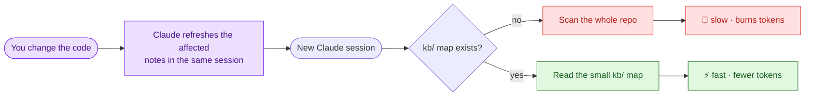

# claude-kb


[](https://www.anthropic.com/claude-code)
[](LICENSE)


[](https://github.com/johnmungandiall/claude-kb/stargazers)

> Stop paying for Claude to re-learn your whole codebase every single session.

**claude-kb** is a one-paste Claude Code prompt that builds a compact,
self-updating knowledge base (`kb/`) for any repo. Every session reads a small
map instead of re-scanning your code — **fewer tokens, faster answers, any language.**

## The problem → the fix

Each new session, Claude re-scans your files to figure out how the project works.
Slow, and it burns tokens every time.

**The fix:** a tiny tree of Markdown notes (`kb/`) that maps the project — entry
points, architecture, features, gotchas — pointing to `path:line` instead of
pasting code. Claude reads the map, not the whole repo.

> [!IMPORTANT]
> **It updates itself.** Change the code — add a feature, rename a file, tweak
> config — and Claude refreshes the affected `kb/` notes in the *same* session.
> The map never drifts from the code, and you never maintain it by hand.

## How it works



## Without vs with claude-kb

|  | Without `kb/` | With `kb/` |
|---|---|---|
| **Start of each session** | Claude re-reads many files to orient | Claude reads one small map |
| **Tokens to get oriented** | High — paid *every* session | Low — the map is read instead |
| **Staying current** | You re-explain the project | Notes auto-update when code changes |
| **Setup** | — | One paste · any language |

## In our testing

Same model — the `kb/` map just lets Claude walk in already knowing your project.
In practice that meant sessions oriented in seconds instead of re-scanning the
repo, spent noticeably fewer tokens getting up to speed, and gave more consistent
answers from one session to the next. Sharper context, not a different brain.

## Get started

Open your repo in Claude Code and paste one prompt. No install, no dependencies.

| Paste this | What it does |
|---|---|
| **[prompt.md](prompt.md)** | **First time** — read the code, build `kb/`, wire `CLAUDE.md` |
| [update.md](update.md) | Already set up — upgrade an existing KB to the latest rules |
| [slim.md](slim.md) | Shrink a bloated `CLAUDE.md` into compact `kb/` notes |
| [verify.md](verify.md) | Audit the KB for drift against the code |
| [check.md](check.md) | Install the drift checker (`tools/kb-check.sh`) |

New here? Start with **[prompt.md](prompt.md)** — that's the whole setup.

## Keeps itself honest

Pointers have to stay accurate, so that's not left to memory —
[tools/kb-check.sh](tools/kb-check.sh) checks it for you (pure git-bash; the
prompts themselves stay Markdown-only):

```bash
bash tools/kb-check.sh              # every path:line resolves? exits 1 if not
bash tools/kb-check.sh --freshness  # also flag notes older than the code they cite
```

Wire it into a pre-commit hook or your release checklist so broken pointers fail
loudly. `verify.md` (and the `kb-verify` agent) run it first when auditing.

## License

[MIT](LICENSE).
